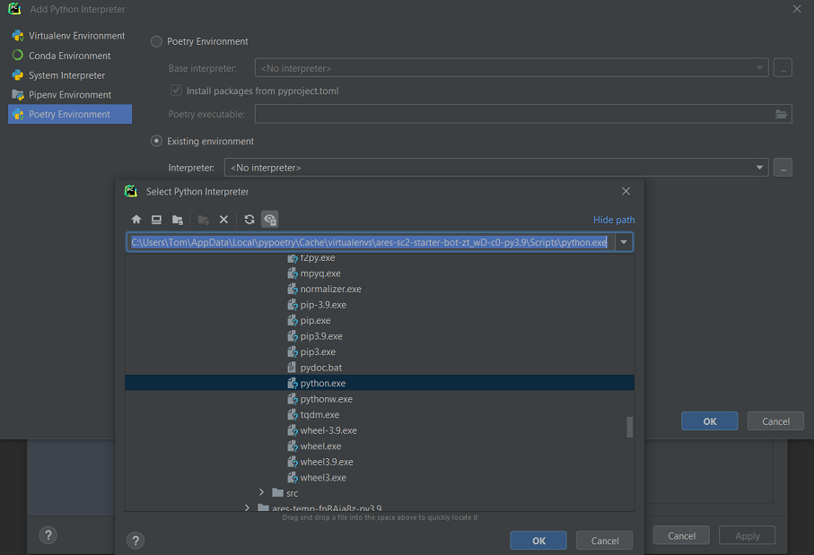
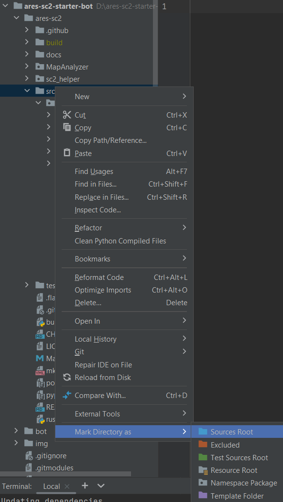

## Installation for developing bots

Interested in contributing to `ares-sc2`? Take a look at setting up a local dev environment
[here instead.](/contributing/index.html#setting-up-a-local-development-environment)

For those interested in creating their own bot, we highly recommend utilizing the `ares-sc2-starter-bot` template, 
which is conveniently accessible at this [location](https://github.com/AresSC2/ares-sc2-starter-bot). This tutorial is
based on the starter bot template repository, as such a basic understanding of Git is required.

### Installation
Before proceeding, ensure the following prerequisites are installed:

- [Python 3.11](https://www.python.org/downloads/release/python-3110/) 
- [Poetry](https://python-poetry.org/) `pip install poetry`
- [Git](https://git-scm.com/)
- [Starcraft 2](https://starcraft2.com/en-gb/)
- [Maps](https://sc2ai.net/wiki/maps/) Ensure maps are moved to the correct folder as suggested in this wiki.

Recommended: [PyCharm IDE](https://www.jetbrains.com/pycharm/) - This tutorial will demonstrate how 
to set up a bot development environment using PyCharm but is an optional step.

### Setup using Git and Github
 - Visit the [starter-bot repo](https://github.com/AresSC2/ares-sc2-starter-bot) and click the 
  `Use this template` button to create your own repository based on this template.
    The repository can be either public or private.

 - Next, clone the repository locally to your system, ensuring you include the `--recursive` flag:

`git clone --recursive <your_git_repo_home_url_here>`

 - Open a terminal or console window.

 - Navigate to the root of your bot's directory:

`cd <bot_folder>`

 - Install dependencies, compile Cython, and create a new isolated virtual environment:

`poetry install`

#### Run:

If you have a non-standard starcraft installation or are using Linux, please adjust `MAPS_PATH` in `run.py`.

Optionally set your bot name and race in `config.yml`

`poetry run python run.py`

#### Start developing
If everything has worked thus far, open up `bot/main.py` and delve into the excitement of bot development!

An `ares-sc2` bot is a [python-sc2](https://github.com/BurnySc2/python-sc2) bot by default, 
meaning any examples or documentation from that repository equally relevant here.

### Uploading to [AiArena](https://www.sc2ai.com)
Included in the repository is a convenient script named `scripts/create_ladder_zip.py`. 
However, it is important to note that the AIarena ladder infrastructure operates specifically 
on Linux-based systems. Due to the dependency of ares-sc2 on cython, it is necessary to execute 
this script on a Linux environment in order to generate Linux binaries.

To streamline this process, a GitHub workflow has been integrated into this repository when pushing to `main` 
on your GitHub repository (if you previously created a template from the 
[starter-bot](https://github.com/AresSC2/ares-sc2-starter-bot)). 
Upon each push to the main branch, the `create_ladder_zip.py` script is automatically executed on a 
Debian-based system. As a result, a compressed artifact named `ladder-zip.zip` is generated, 
facilitating the subsequent upload to AIarena. To access the generated file, navigate to the Actions tab, 
click on an Action and refer to the Artifacts section. Please note this may take a few
minutes after pusing to the `main` branch.

### PyCharm

#### Adding `poetry` environment
Find the path of the environment `poetry` created in the installation step previously, copy and paste
or save this path somewhere.

`poetry env list --full-path`

Open this project in PyCharm and navigate to:

File | Settings | Project: <project name> | Python Interpreter

 - Click `Add Interpreter`, then `Add Local Interpreter`

 - Select `Poetry Environment`, and choose `Existing Environment`
 - Navigate to the path of the poetry environment from the terminal earlier, and select `Scripts/python.exe`

Now when opening terminal in PyCharm, the environment will already be active. 
New run configurations can be setup,
and they will already be configured to use this environment.

#### Marking sources root
For PyCharm intellisense to work correctly:
 - Right-click `ares-sc2/src` -> Mark Directory as -> Sources Root

   
## Update `ares-sc2`
This may take a minute or two

`python scripts/update_ares.py`

## Format code
`black .`

`isort .`
